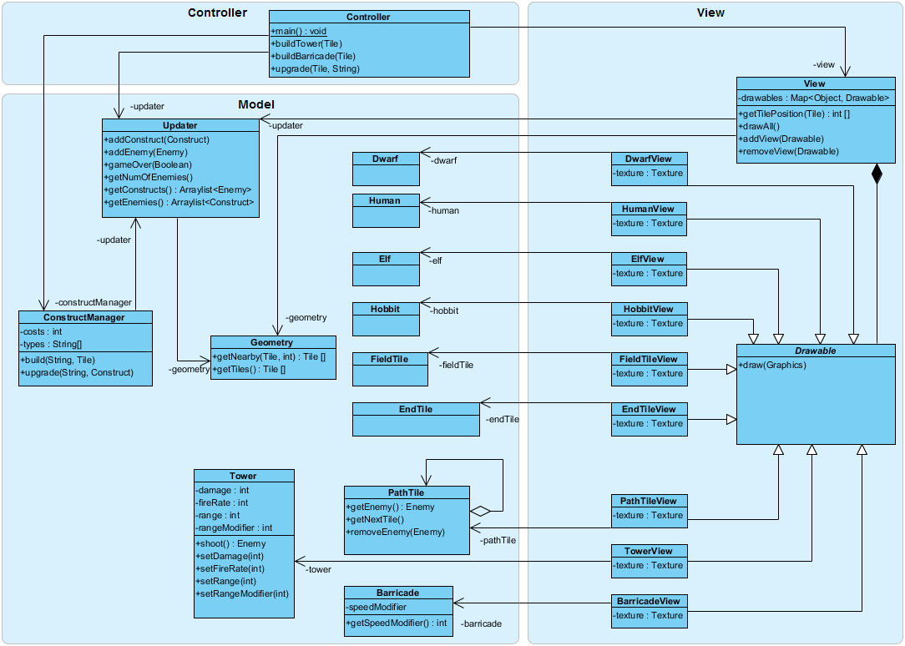
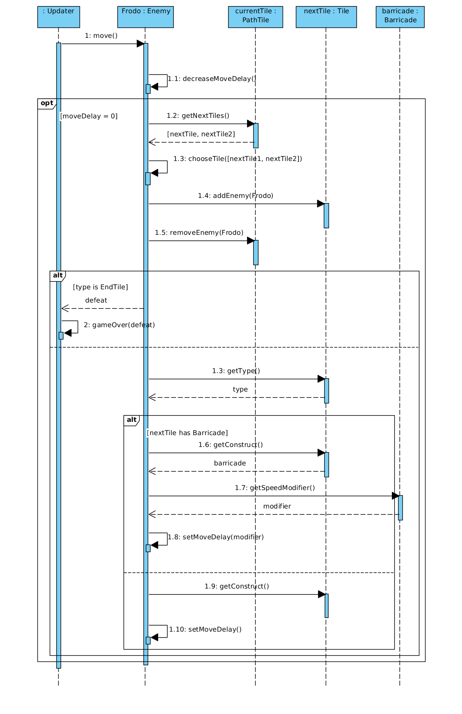
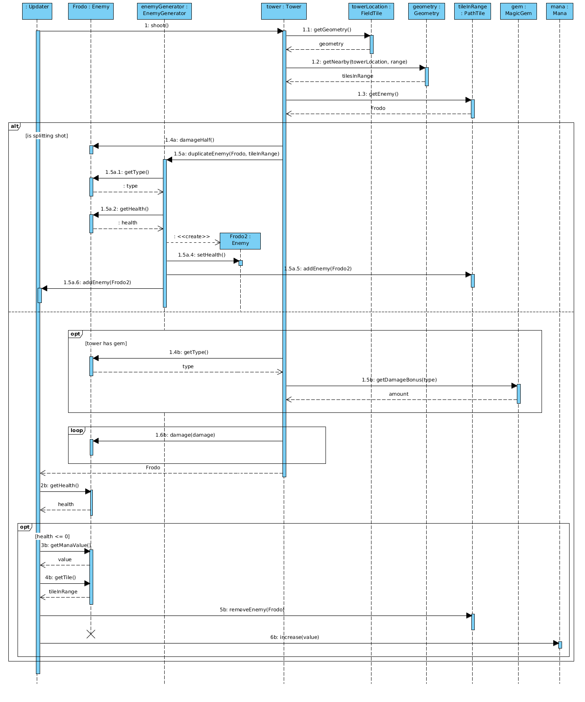

Szoftlab4-Tower_Defense
=======================
 

Feladat specifikációja:
-----------------------

A két torony

A gonosz emberek, tündék, törpök és hobbitok szövetséget kötnek, hogy elpusztítsák az Egy Gyűrűt a Végzet Hegyénél. Szerencsére csak Mordor földjén keresztül tudnak eljutni a hegyhez, így jóságos Szarumánnak lehetősége van védelmi tornyokat építeni, hogy segítsen megvédeni Szauron hatalmát. A játék célja annak megakadályozása, hogy a Gyűrű szövetségének tagjai közül bárki is eljusson a Végzet Hegyéhez. Egy ellenség akkor pusztul el, ha összességében megfelelő mértékű sebzést kap a tornyokból származó lövedékektől. A tornyok építéséhez Szarumánnak a varázserejét kell használnia. Szarumán akkor tud tornyot építeni, ha megfelelő mennyiségű varázsereje van hozzá. A varázsereje minden egyes elpusztított ember, tünde, törp vagy hobbit után bizonyos mértékben növekszik.

A Gyűrű szövetségének tagjai különböző utakon juthatnak el a Végzet Hegyéhez. Az utakról nem térhetnek le. Szarumán az utakra nem tud tornyot építeni, csak az utak mellé. Az utakra azonban tehet akadályokat, amik az akadály területén lassítják az ellenség haladását. A tornyoknak van egy adott hatótávolsága és tüzelési gyakorisága. Szarumán a varázserejét arra is használhatja, hogy a tornyokat és akadályokat különböző varázskövekkel ruházza fel. A varázsköveknek több fajtája is létezik, és különböző hatásúak lehetnek. Egyes kövek növelhetik a tornyok hatótávolságát vagy tüzelési gyakoriságát, más kövek egy-egy típusú ellenfél esetén megnövelik a lövedékek sebzési erejét.

A játék során az ellenségek folyamatosan jönnek. A játék elején ritkábban, később gyakrabban és nagyobb csoportokban, azonban számuk véges, előbb-utóbb elfogynak. A játék akkor ér véget, ha egy ellenség eljut a Végzet Hegyéhez, vagy ha már sikerült az összes ellenséget kiirtani. Az első esetben Szauron és Szarumán megsemmisül, utóbbi esetben fényes győzelmet aratnak és örökké uralni fogják a világot.

Specifikáció változás:

1. A tornyokra időnként köd ereszkedik, aminek következtében a látás erősen lecsökken. Ez hatással van a lövésre.
2. A játékosok által járható útvonalon lehetnek elágazások és becsatlakozások. Az elágazásokon az egyes játékosok véletlenszerűen mennek a különböző irányokba.
3. A tornyokban elvétve lehetnek olyan lövedékek, amelyek az eltalált játékost kettőbe vágják. A két játékos egymástól függetlenül él tovább, csökkentett életerővel. 
	
Diagramok:
----------

###Use-case diagram:

###Class diagram:

###Sequence diagramok:

1. Építés:

 
2. Ellenség-generálás:

 
3. Hatótáv-fejlesztés:

 
4. Lépés:

 
5. Lövés:

 
6. Játékos nyer:

 
7. Leszáll a köd:

 
8. Felszáll a köd:

 

9. Controller: építés:

 
10. Controller: fejlesztés: 

 
11. View

 
 
 